# 1.Introduction to the wheat package 

### A better reading experience: https://johnsunx1.github.io/SeedlingCV-Instraction/

This package is a python package used to help users process wheat field pictures, suitable for processing wheat field pictures in the two-leaf to three-leaf period.

you can now Download the project at  https://github.com/johnsunx1/SeedlingCV  or   https://gitee.com/deepbiology/seedlingcv  

This is a documentation to help users use python packages. The main functions of this package include identification of wheat seedlings and vacancy statistics of wheat fields.  

The number of wheat seedlings is identified by the vgg neural network model，We referenced this https://github.com/ZhihengCV/Bayesian-Crowd-Counting

Vacancy recognition using yolov5 neural network model，We referenced this  https://github.com/ultralytics/yolov5 ，https://github.com/dyh/unbox_yolov5_deepsort_counting

## 1.1 Identification of wheat seedlings

For pictures:  


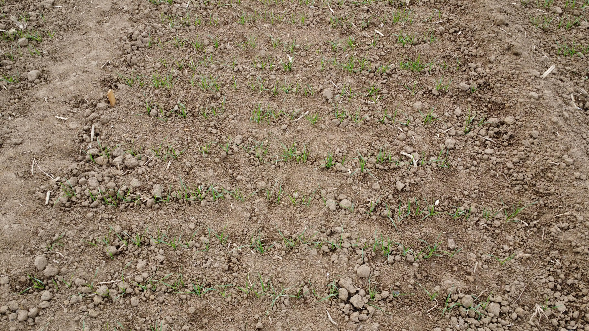

We can get the following processing results:：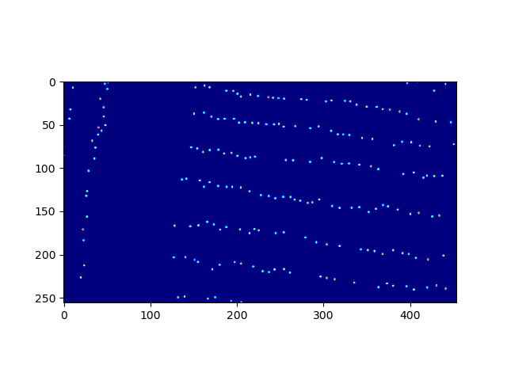

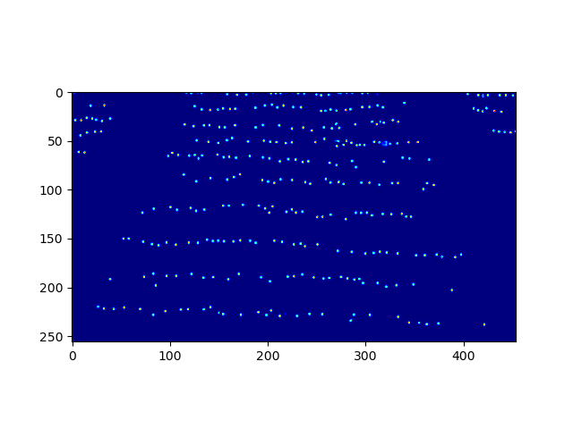

2.and a txt document containing the statistical results(result.txt)：


## 1.2 Vacancy information statistics


for a given wheat field picture：


Processing the original image, we can get the following results:  

### 1.2.1 Vacancy position marker


We assign an id to each vacancy, and the id is assigned according to the position of the vacancy.

### 1.2.2Vacancy area statistics

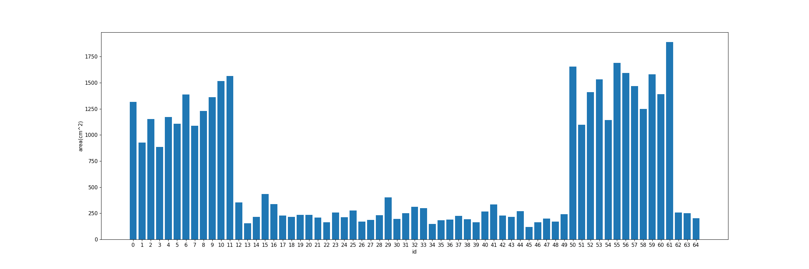

### 1.2.3Vacancy length statistics  


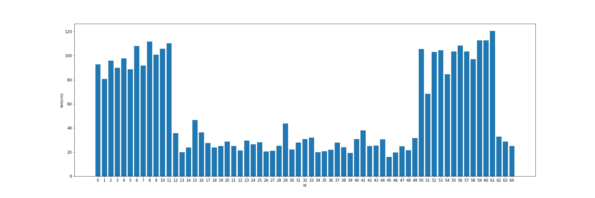

### 1.2.4The relationship between vacancy area and location  

.png)


### 1.2.5The relationship between vacancy length and location

.png)


# 2. Environment configuration

## 2.1 Basic environment configuration

* Python>=3.7 

* pytorch>=1.7

  `https://pytorch.org/get-started/locally/ `

  You can choose the version of pytorch that suits you to install：

  

* cuda>=10.2

* pycharm

## 2.2 Project download

`$ git clone 仓库地址  # clone repo` 

`$ cd Wheat`

`$ pip install -r requirements.txt  # install dependencies` 

# 3. Instructions

## 3.1 data collection

Obtain the wheat field video through the drone, and keep the drone flying at an appropriate height and level to obtain a clearer wheat field video


We provide users with a video processing toolkit：`Vedio_util`

Put the video under the `Vedio_util` folder：


### 3.1.1 Convert video to frames

* Before converting the video into frames, you need to modify the second line of get_picture.py to the name of your own video. (as follows)


* Then adjust the interval between the captured frames according to the video conditions (the interval unit is the number of frames, as follows).The user must ensure that the two adjacent frames captured from the video have a degree of overlap greater than 70%, so as to facilitate the subsequent synthesis of the entire wheat field picture.


* The video frame can be obtained by running `get_picture.py`, the video frame is saved in the `picture` folder，The user can select the path of the video and the interval of the video frame in `get_picture.py`, and the obtained result is saved in the `vedio_util/picture` folder.


### 3.1.2 Picture synthetic wheat field panorama

After getting the video frames, we need to stitch the video frames to get the panorama of the wheat field.If the panorama of the wheat field you want to synthesize is small, you can run `compound_picture.py` to synthesize the panorama, but when the wheat field is larger, we recommend using [webodm](https://github.com/OpenDroneMap/WebODM) for compositing. "


Execute `compound_picture.py`, the result is final-1.jpg (original image) final-2.jpg (The image we processed for the user), the user can choose according to their actual situation and save it in the `Vedio_util` folder:

final-1：

final-2：


###  3.1.3 split panorama

Users can segment the panorama of the wheat field by running `shear.py`. We need to segment the panorama of the wheat field(final.jpg) so that the image specifications meet the requirements for identifying the number of wheat seedlings. （The segmented image will be used for the count of wheat seedlings, not for gap detection.The number of wheat seedlings is suitable for the two-leaf to three-leaf stage of wheat seedlings, but the wheat seedlings in the demo picture have exceeded the optimal detection period, so it is not suitable for the detection of wheat seedlings.）The obtained results are saved in `sheared`.

Here the user can select a picture to split：

## 3.2Vacancy recognition

* Put the panorama into `Vacant-Count/img`,


*  The image format is higher than width, as follows:


Avoid :


* After putting the image in, the user changes the name to the name of his own image in `Vacant_detect.py`:

，

* Because we use horizontal segmentation in the process of processing panoramas, we need to adjust the required image format to a format whose height is greater than its width. Of course, the user can adjust the cutting method according to the situation. The code is shown in Vacant_detect.py, and the code is as follows:

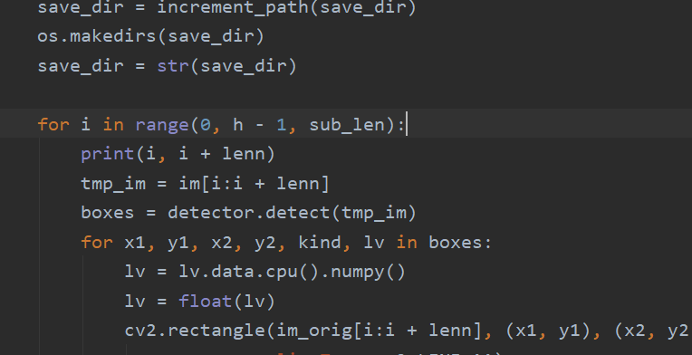


* You can choose appropriate parameters in `Vacant_detect.py`

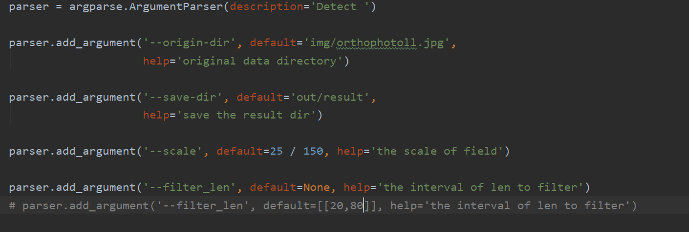

The parameter `scale` is how many centimeters each pixel represents，in fractional form：The numerator represents how many centimeters, and the denominator represents pixels. Users can choose according to the actual situation.The picture given is 150 pixels representing the actual length of 25cm.

The parameter filter_len is the vacancy screening range. The default vacancy screening range is 20cm~80cm. The user can also set multiple screening ranges, as follows:

```python
parser.add_argument('--filter_len', default=[[20, 30],[40,50]], help='the interval of len to filter')
```

  At this time, the result only includes the statistical results of vacancies with lengths between 20~30 and 40~50, and the other length vacancies will be ignored.

* Users can also set recognition confidence, iou and other parameters under `detector.py`.


* run`Vacant_detect.py`。The result is saved in `out`。


In addition: due to the overlapping segmentation of the panorama during the running of the program, such as 0-100, 50-150 segmentation, there will be repetitions at the overlap of 50-100, such as:


Hence there is also a filter nms to remove duplicates.


The filtering effect can be adjusted by adjusting the value of thresh. The smaller the value, the greater the filtering `strength`. After filtering:


In addition, the overlap ratio can also be adjusted by itself. See line 172 of `vacant-count.py`.

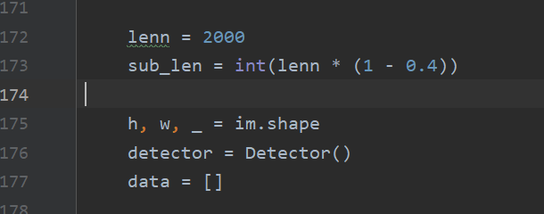

If the histogram display is not good, crowding occurs, such as:

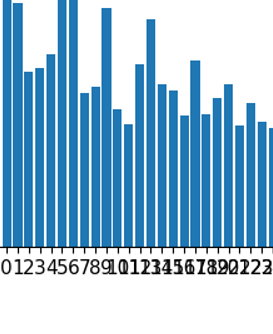

You can try to modify the ratio of: figsize.


## 3.3Quantity detection of wheat seedlings

* Put the smaller images that the panorama is divided into under `Wheat-count/Dete-orig`, and run `preprocess_detect.py` to preprocess the images into a specific format. The results obtained are under `Detect_processed`.
* User can set parameters in `detect.py`

```python
parser.add_argument('--data-dir', default='Detect-processed/detect',
                    help='training data directory')

parser.add_argument('--weights-dir', default='weights/best_model.pth',
                    help='model directory')

parser.add_argument('--device', default='0', help='assign device')

parser.add_argument('--out-detect-dir', default='out_detect/result', help='the result dir')
```

* Run `detect.py` to get the renderings and txt files containing statistical information, and save the results to `out_dectect`.

# 4.train on your own dataset

## 4.1seedling count（VGG neural network model training）

### 4.1.1 [Annotation tool](https://github.com/Elin24/cclabeler) 

With this annotation tool, you can get `json` files, but this project needs to use `mat` files

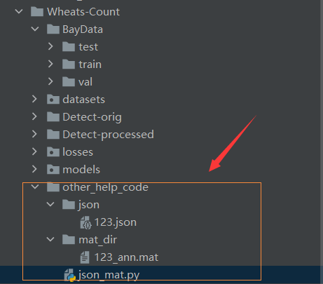

  We provide users with a tool `other_help_code` for json to mat

  Put the marked json file in the `json` folder and execute json_mat.py to get the `mat` format file.

### 4.1.2 data processing

Divide the `mat` file and the corresponding image into a training set and a test set according to the following organization methods

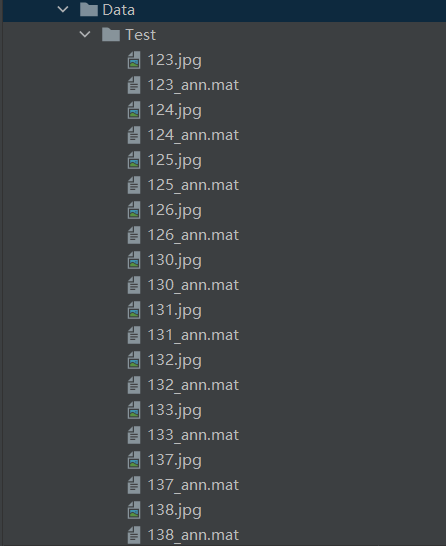


`train.txt` is used as a training set image

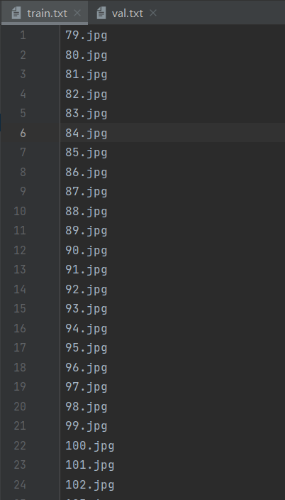


val.txt is used as a validation set image:

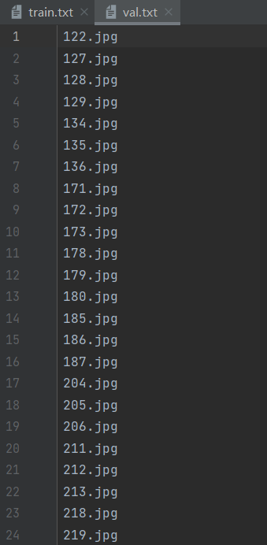

Both the validation set val and the training set train data are stored in the `train` folder.

After the data allocation is completed, execute `process_dataset.py` to get the `BayData` folder after the processing is completed.

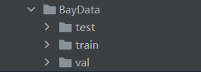

### 4.1.3 train

In `train.py`, set the appropriate parameters for training

```python
parser = argparse.ArgumentParser(description='Train ')

parser.add_argument('--data-dir', default='BayData',
                    help='training data directory')

parser.add_argument('--save-dir', default='vgg',
                    help='directory to save models.')

parser.add_argument('--lr', type=float, default=1e-5,
                    help='the initial learning rate')

parser.add_argument('--weight-decay', type=float, default=1e-4,
                    help='the weight decay')
parser.add_argument('--resume', default='',
                    help='the path of resume training model')
parser.add_argument('--max-model-num', type=int, default=1,
                    help='max models num to save ')
parser.add_argument('--max-epoch', type=int, default=700,
                    help='max training epoch')
parser.add_argument('--val-epoch', type=int, default=4,
                    help='the num of steps to log training information')
parser.add_argument('--val-start', type=int, default=500,
                    help='the epoch start to val')

parser.add_argument('--batch-size', type=int, default=1,
                    help='train batch size')
parser.add_argument('--device', default='0,1', help='assign device')
parser.add_argument('--num-workers', type=int, default=8,
                    help='the num of training process')

parser.add_argument('--is-gray', type=bool, default=False,
                    help='whether the input image is gray')
parser.add_argument('--crop-size', type=int, default=512,
                    help='the crop size of the train image')
parser.add_argument('--downsample-ratio', type=int, default=8,
                    help='downsample ratio')

parser.add_argument('--use-background', type=bool, default=True,
                    help='whether to use background modelling')
parser.add_argument('--sigma', type=float, default=8.0,
                    help='sigma for likelihood')
parser.add_argument('--background-ratio', type=float, default=1.0,
                    help='background ratio')
```

After the training is completed, the user can check the training effect by executing `test.py`


From left to right are the `picture id`, `the difference between the number of wheat marked by the user minus the predicted value`, `the number of wheat marked by the user`, `the number of predicted wheat`

Results visualization：

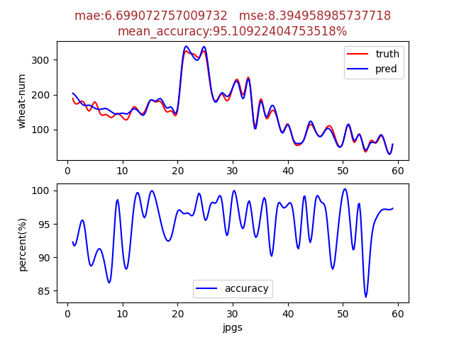

## 4.2Vacancy recognition（yolov5Training of Neural Network Models）

This project does not provide yolov5 training function, users can conduct their own model training by visiting [yolov5](https://github.com/ultralytics/yolov5).
